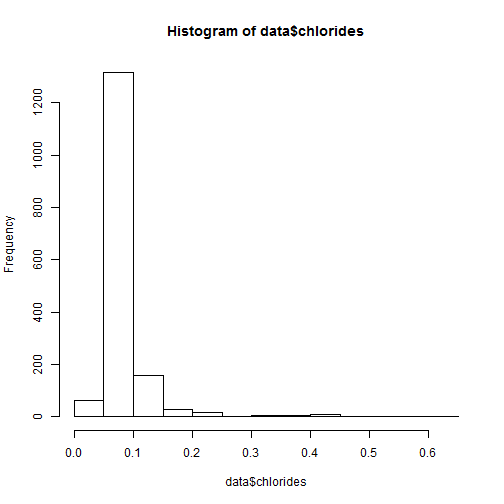

Reproducible Pitch Presentation
========================================================
author: Zoom
date: 
autosize: true

Overview
========================================================

This is the simple example for Shiny application and can be achieved at the this website: 
<https://zoomzoom1011.shinyapps.io/Shiny/>.

Source code files ui.R and server.R are stored in Github: 
<https://github.com/zoomzoom1011/Data_Science_Coursera/tree/master/9_Developing_Data_Products/Week4/shiny_application>.


Web Application Goal
========================================================

This application will be used to see the chlorides amount in the wine from the machine learning databases. 
For user, you can adjust bin number to see view the different width's influence for the display. 

Data summary
========================================================


```r
url <- "https://archive.ics.uci.edu/ml/machine-learning-databases/wine-quality/winequality-red.csv"
data <- read.csv(url, sep = ";")
summary(data$chlorides)
```

```
   Min. 1st Qu.  Median    Mean 3rd Qu.    Max. 
0.01200 0.07000 0.07900 0.08747 0.09000 0.61100 
```

Slide With Plot
========================================================


